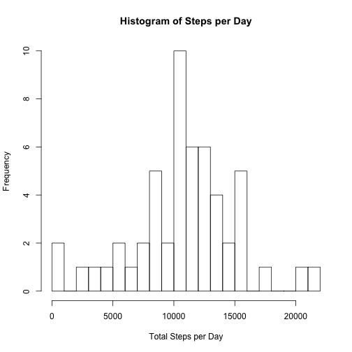
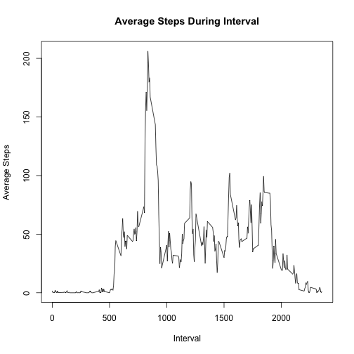
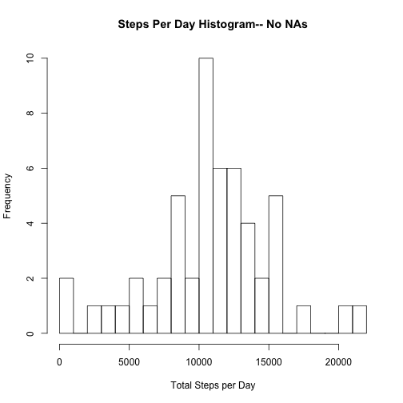
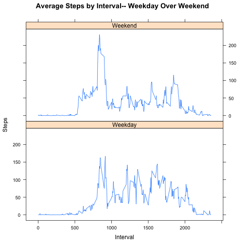

Reproducible Research- Assignment 1
========================================================

The following report analyzes data from a personal activity device that collects data at 5 minute intervals through out the day. This data set consists of two months of activty from an anonymous individual. 

The variables in the dataset are 

- **steps**: Number of steps taken during a 5 minute interval
- **date**: Date of measurements collected
- **interval**: 5 minute interval in which measurements were collected

###Loading and preprocessing the data


```r
URL<-"https://d396qusza40orc.cloudfront.net/repdata%2Fdata%2Factivity.zip"
download.file(URL, destfile = "./data.zip",method="curl")
unzip("./data.zip")
data<-read.csv("activity.csv")
```

###What is mean total number of steps taken per day?

Below is a histogram of the total number of steps taken each day

```r
require(plyr)
sum<-ddply(data, ~date,summarize,tot=sum(steps))
hist<-as.numeric(sum$tot)
hist(hist,breaks=20,main="Histogram of Steps per Day",xlab="Total Steps per Day")
```

 

The mean and median of the steps taken each day can be displayed using the summary function

```r
summary(sum$tot)
```

```
##    Min. 1st Qu.  Median    Mean 3rd Qu.    Max.    NA's 
##      41    8840   10800   10800   13300   21200       8
```

###What is the average daily activity pattern?

We can further explore the data by producing a line plot that shows the average number of steps by interval across all days


```r
avg_int<-aggregate(.~interval,data,"mean")
plot(avg_int$interval,avg_int$steps, type="l",ylab="Average Steps",xlab="Interval",main="Average Steps During Interval")
```

 

The interval with the highest average number of steps can be found using the max() function


```r
max<-max(avg_int$steps)
max_interval<-avg_int[avg_int$steps==max,]
max_interval$interval
```

```
## [1] 835
```

###Inputting missing values

Furthermore, the data consists of many rows without measurements. Using the is.na function in R, we can subset the data for only measurements with "NA" and count the number of rows missing data.


```r
na_data<-subset(data, is.na(data$steps))
nrow(na_data)
```

```
## [1] 2304
```

We now use the average number of steps in an interval to replace the rows missing measurements. Displayed is the beginning of a new dataset without "NA".


```r
replace_na_data<-merge(avg_int, na_data, by="interval")
final_na<-replace_na_data[,c(2,5,1)]
colnames(final_na)<-c("steps","date","interval")
no_na<-na.omit(data)
Q2_data<-rbind(no_na,final_na)
head(Q2_data)
```

```
##     steps       date interval
## 289     0 2012-10-02        0
## 290     0 2012-10-02        5
## 291     0 2012-10-02       10
## 292     0 2012-10-02       15
## 293     0 2012-10-02       20
## 294     0 2012-10-02       25
```

Similar to the previous dataset, a histogram of the total steps per day with the "NA" measurements replaced with the average steps per interval over all days is displayed below.


```r
Q2_sum<-ddply(Q2_data, ~date,summarize,tot=sum(steps))
Q2_hist<-as.numeric(sum$tot)
hist(Q2_hist,breaks=20,main="Steps Per Day Histogram-- No NAs",xlab="Total Steps per Day")
```

 

The histogram, mean and median seem to be unchanged by removing the "NA" from the dataset.


```r
summary(Q2_sum$tot)
```

```
##    Min. 1st Qu.  Median    Mean 3rd Qu.    Max. 
##      41    9820   10800   10800   12800   21200
```

###Are there differences in activity patterns betweem weekdays and weekends?

To analyze the activity patterns on weekdays and weekends, the function weekdays() is used to determine the day of week a measurement is recorded. 

```r
day<-weekdays(as.Date(Q2_data$date))
Q3_data<-cbind(Q2_data,day)
weekday<-subset(Q3_data,day=="Monday"|day=="Tuesday"|day=="Wednesday"|day=="Thursday"|day=="Friday")
weekend<-subset(Q3_data,day=="Sunday"|day=="Saturday")
day_data<-aggregate(.~interval,weekday,"mean")
end_data<-aggregate(.~interval,weekend,"mean")
Q3_final_data<-rbind(end_data,day_data)
Q3_final_data$day[Q3_final_data$day==3.5]<-"Weekday"
Q3_final_data$day[Q3_final_data$day==4.2]<-"Weekend"
head(Q3_final_data)
```

```
##   interval    steps date     day
## 1        0 0.214623   31 Weekday
## 2        5 0.042453   31 Weekday
## 3       10 0.016509   31 Weekday
## 4       15 0.018868   31 Weekday
## 5       20 0.009434   31 Weekday
## 6       25 3.511792   31 Weekday
```

The line graphs below show the differences between weekend and weekday activity for this individual.


```r
library(lattice)
library(datasets)
xyplot(Q3_final_data$steps~Q3_final_data$interval|Q3_final_data$day,main="Average Steps by Interval-- Weekday Over Weekend",xlab="Interval",ylab="Steps",type="l",layout=c(1,2))
```

 
